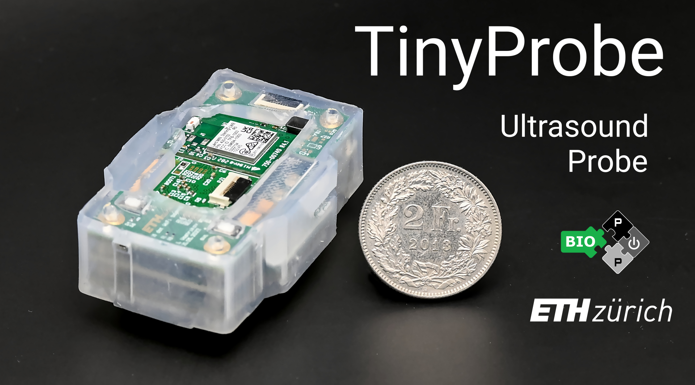
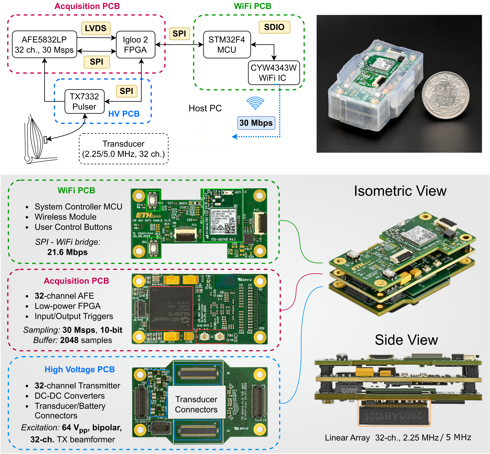
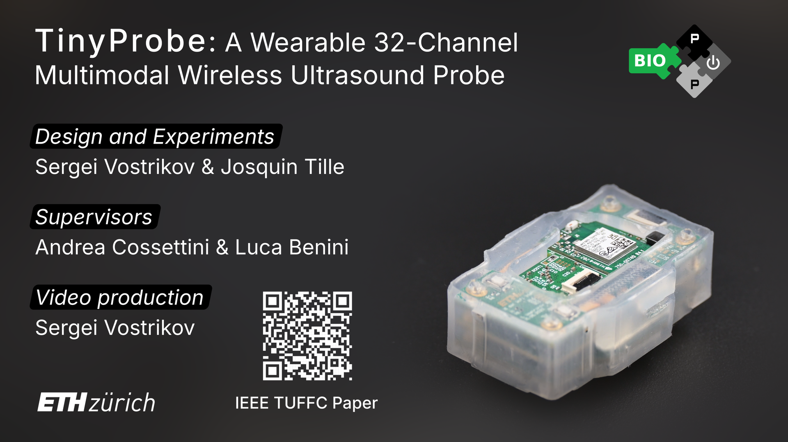

# TinyProbe v0.1.0
### A Wearable 32-Channel Multi-Modal Wireless Ultrasound Probe

## Introduction

This repository contains work in progress on TinyProbe, an advanced wearable ultrasound platform.

## Specifications

TinyProbe is a compact research platform for low-power ultrasound sensing, featuring the following specifications:

### Transmit
- **64 V peak-to-peak** bipolar excitations  
- **32 pattern profiles** (fully programmable)  
- **16 delay profiles** (fully programmable)  

### Receive
- **21, 18, or 15 dB** low-noise amplifier (programmable)  
- **21, 24, or 27 dB** programmable gain amplifier (PGA)  
- **Up to 36 dB TGC** (fully programmable)  
- **32 channels** (simultaneously sampled at up to **30 MSps, 10 bit**)  

### Connectivity
- Wireless link (Wi-Fi 4, **21.6 Mbps**)  
- or Wireless link II (WiUS board, Wi-Fi 6, **35.7 Mbps**)  

### Operating Modes
1. **A-mode**, **B-mode**, **M-mode** with 32 channels (**33 FPS with Wi-Fi 4, 55 FPS with Wi-Fi 6**)  
2. **Doppler mode** with 2 channels (**1400 FPS**)  
3. **Raw RF data streaming** (**55 FPS**, 32 channels, 2000 samples per channel, 10 bit per sample)  

### Power Consumption
With Wi-Fi 4 shield:  
- **970 mW** for operating modes 1 and 3, **1400 mW** for operating mode 2  
- **100 mW** in power-save mode  

## TinyProbe System Diagram



## YouTube Overview
<a href="https://www.youtube.com/watch?v=qGP9-kKss0g">
  
</a>

## Repository Structure

This repository has the following folders:

- `wifi_6_board`: source files for the WiUS Wi-Fi 6 board, namely:  
  - firmware for the SiWG917 MCU, located in `fw/`  
  - CAD design files for the WiUS PCB shield, located in `hw/`  
- `acquisition_board`: source files for the acquisition board (Work in Progress)  
- `hv_tx_board`: source files for the high-voltage PCB (Work in Progress)  
- `host_pc`: Python code for the TinyProbe Python interface  
- `docs`: project documentation (Work in Progress)  

## Documentation

Additional documentation (e.g., how to reproduce results, how to use the probe) will be added in later releases.

## Citation

If you would like to reference the TinyProbe project, please cite:

```
@article{vostrikov2024tinyprobe,
  title={TinyProbe: A wearable 32-channel multi-modal wireless ultrasound probe},
  author={Vostrikov, Sergei and Tille, Josquin and Benini, Luca and Cossettini, Andrea},
  journal={IEEE Transactions on Ultrasonics, Ferroelectrics, and Frequency Control},
  year={2024},
  publisher={IEEE}
}
```

If you would like to reference only the WiUS project (Wi-Fi 6 PCB design), please cite:

```
@inproceedings{hirschi2025wulpus,
  title={High Frame Rate Arterial Monitoring via Wi-Fi 6 on a 32-channel Wearable Ultrasound Probe},
  author={Hirschi, Cédric and Vostrikov, Sergei and Cossettini, Andrea and Benini, Luca},
  booktitle={2025 IEEE International Ultrasonics Symposium (IUS)},
  pages={1--4},
  year={2025},
  organization={IEEE}
}
```

## Authors

The TinyProbe system was developed at the [Integrated Systems Laboratory (IIS)](https://iis.ee.ethz.ch/) at ETH Zurich by:
- [Sergei Vostrikov](https://scholar.google.com/citations?user=a0KNUooAAAAJ&hl=en) (Full-stack TinyProbe design)  
- [Cédric Hirschi](https://www.linkedin.com/in/c%C3%A9dric-cyril-hirschi-09624021b/) (Full-stack WiUS shield design)  
- [Andrea Cossettini](https://scholar.google.com/citations?user=d8O91jIAAAAJ&hl=en) (Supervision, project administration)  
- [Luca Benini](https://scholar.google.com/citations?hl=en&user=8riq3sYAAAAJ) (Supervision, project administration)  

## License

This repository makes use of the following licenses:  
- for all *hardware*: [Solderpad Hardware License Version 0.51](licenses/LICENSE.hw)  
- for all *software*: [Apache License Version 2.0](licenses/LICENSE.sw)  
- for all *images*: [Creative Commons Attribution 4.0 International License](licenses/LICENSE.images)  

For further information, please refer to the license files: `LICENSE.hw`, `LICENSE.sw`, `LICENSE.images`.

The `wifi_6_board/fw/` directory contains third-party sources that come with their own
licenses. See the respective folders and source files for the licenses used.

## Limitation of Liability

In no event and under no legal theory, whether in tort (including negligence), contract, or otherwise, unless required by applicable law (such as deliberate and grossly negligent acts) or agreed to in writing, shall any Contributor be liable to You for damages, including any direct, indirect, special, incidental, or consequential damages of any character arising as a result of this License or out of the use or inability to use the Work (including but not limited to damages for loss of goodwill, work stoppage, computer failure or malfunction, or any and all other commercial damages or losses), even if such Contributor has been advised of the possibility of such damages.
