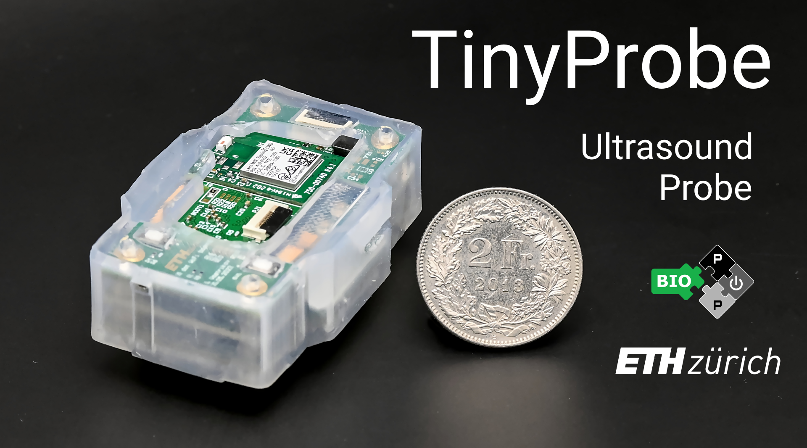
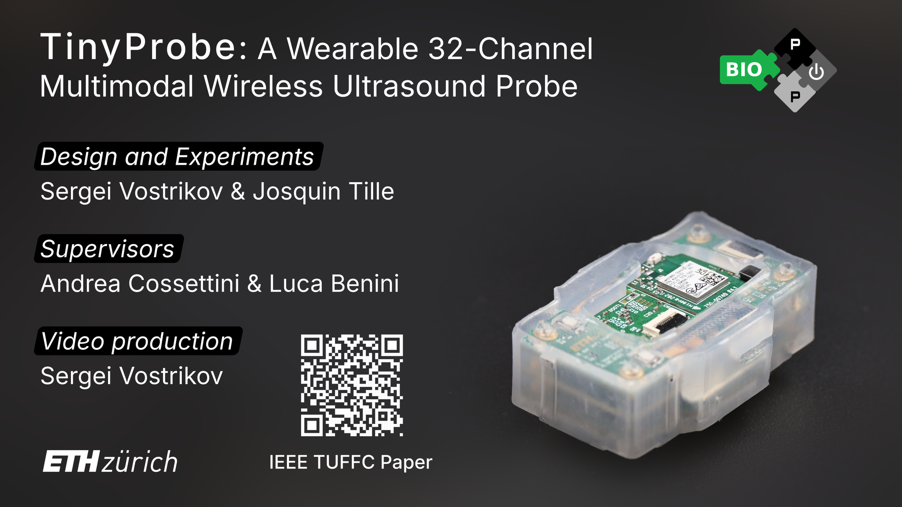

# TinyProbe

A Wearable 32-Channel Multi-Modal Wireless Ultrasound Probe


## Introduction

This repository contains ongoing work on **TinyProbe**, an advanced wearable ultrasound platform developed at the [Integrated Systems Laboratory (IIS)](https://iis.ee.ethz.ch/) of ETH Zurich.

The system design is described in detail in our publications in the [IEEE Transactions on Ultrasonics, Ferroelectrics, and Frequency Control (TUFFC)](https://ieeexplore.ieee.org/document/10750870) and in the [Proceedings of the IEEE International Ultrasonics Symposium (IUS 2025)](https://2025.ieee-ius.org/).

Please also take a look at our overview video on YouTube:

<a href="https://www.youtube.com/watch?v=qGP9-kKss0g">
  
</a>


## Development

This repository uses [`uv`](https://docs.astral.sh/uv/) and [`just`](https://github.com/casey/just) for Python dependency and tool management. `just` is also included in the Python environment for convenience.

You can run `just` from the project root to see all available targets:

```bash
uv run just # Without activating Python environment
just # After activating Python environment / Using native binary
```

There is a [root workspace](pyproject.toml) at the project root as well as a [host project](software/pyproject.toml) project in the software directory.

The root workspace installs the host project in editable mode, so host development commands can also be run from the repository root.


### Dependency groups

You may not always need all of the dependencies, which is why there are multiple [dependency groups](https://docs.astral.sh/uv/concepts/projects/dependencies/#dependency-groups) with their own set of packages.


#### Root Workspace

| Group | Purpose |
| --- | --- |
| base | `just` and the host project |
| `dev` | Code generation and pre-commit hooks ([`embgen`](https://github.com/CedricHirschi/embgen), [Protocol Buffers](https://protobuf.dev/), [`prek`](https://prek.j178.dev/)) |
| `doc` | Documentation generation and serving ([Material for MkDocs](https://squidfunk.github.io/mkdocs-material/)) |

To install all of dependencies, run:

```bash
uv sync --group dev --group doc
```

#### Host Project

| Group | Purpose |
| --- | --- |
| base | Core dependencies for all functionalities |
| `dev` | Tests, linting, and type checking ([`pytest`](https://docs.pytest.org/en/stable/), [`ruff`](https://docs.astral.sh/ruff/), [`ty`](https://docs.astral.sh/ty/)) |
| `demo` | Demonstration and visualization ([`matplotlib`](https://matplotlib.org/)) |


To install all of dependencies, run:

```bash
cd software
uv sync --group dev --group demo
```


## Documentation

The MkDocs documentation in `docs/` starts with a system overview, followed by host software and Wi-Fi 6 firmware references. New
contributors should begin with the system overview to understand how the host,
MCU, FPGA, AFE, and TX paths fit together. Build or serve the site locally from
the repository root:

```bash
just docs_serve
```


## Citation

If you would like to reference the TinyProbe project, please cite:

```
@article{vostrikov2024tinyprobe,
  title={TinyProbe: A wearable 32-channel multi-modal wireless ultrasound probe},
  author={Vostrikov, Sergei and Tille, Josquin and Benini, Luca and Cossettini, Andrea},
  journal={IEEE Transactions on Ultrasonics, Ferroelectrics, and Frequency Control},
  year={2024},
  publisher={IEEE}
}
```

If you would like to reference only the Wi-Fi 6 PCB design, please cite:

```
@inproceedings{hirschi2025high,
  title={High Frame Rate Arterial Monitoring via Wi-Fi 6 on a 32-channel Wearable Ultrasound Probe},
  author={Hirschi, Cédric and Vostrikov, Sergei and Cossettini, Andrea and Benini, Luca},
  booktitle={2025 IEEE International Ultrasonics Symposium (IUS)},
  pages={1--4},
  year={2025},
  organization={IEEE}
}
```


## Authors

The TinyProbe system was developed at the [Integrated Systems Laboratory (IIS)](https://iis.ee.ethz.ch/) at ETH Zurich by:

- [Sergei Vostrikov](https://scholar.google.com/citations?user=a0KNUooAAAAJ) (Full-stack TinyProbe design)
- [Cédric Hirschi](https://www.linkedin.com/in/c%C3%A9dric-cyril-hirschi-09624021b/) (Firmware & Software development, supervision)
- [Soumyo Bhattachjaree](https://scholar.google.com/citations?user=m5mJcRIAAAAJ) (Gateware, Firmware development)
- [Federico Villani](https://scholar.google.com/citations?user=5LgLMCEAAAAJ) (Hardware development, supervision)
- [Andrea Cossettini](https://scholar.google.com/citations?user=d8O91jIAAAAJ) (Supervision, project administration)
- [Luca Benini](https://scholar.google.com/citations?hl=en&user=8riq3sYAAAAJ) (Supervision, project administration)


## License

This repository makes use of the following licenses:

- for all *hardware* (`*hw/` folders): [Solderpad Hardware License Version 0.51](licenses/LICENSE.hw)
- for all *software* (`*software/`): [Apache License Version 2.0](licenses/LICENSE.sw)
- for all *images* (`*docs/images` folders): [Creative Commons Attribution 4.0 International License](licenses/LICENSE.images)

For further information, please refer to the license files: `LICENSE.hw`, `LICENSE.sw`, `LICENSE.images`.

The `firmware/` directory contains third-party sources that come with their own
licenses. See its [README](firmware/README.md) for more information.


## Limitation of Liability

In no event and under no legal theory, whether in tort (including negligence), contract, or otherwise, unless required by applicable law (such as deliberate and grossly negligent acts) or agreed to in writing, shall any Contributor be liable to You for damages, including any direct, indirect, special, incidental, or consequential damages of any character arising as a result of this License or out of the use or inability to use the Work (including but not limited to damages for loss of goodwill, work stoppage, computer failure or malfunction, or any and all other commercial damages or losses), even if such Contributor has been advised of the possibility of such damages.
