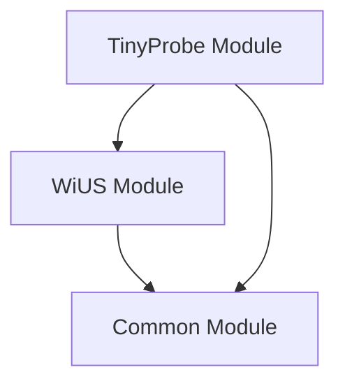

# Firmware Overview

TinyProbe firmware runs on the Wi-Fi 6 MCU. It receives host commands, controls
the SPI mux, configures FPGA/AFE/TX devices, manages board power domains, waits
for FPGA acquisition events, reads captured data over SPI, and streams RF data
back to the host.

Start with the [system overview](../system/index.md) for the full acquisition
flow, then use [Hardware & Control](../system/hardware-control.md) for the MCU
control paths. The generated API pages below document the firmware modules.

We have the [common module](group__common.md), [WiUS module](group__wius.md), and [TinyProbe module](group__tinyprobe.md) documented here. These three modules have the following relationships:

