# Acquisition Timing

The FPGA waveform generator defines the timing of one shot period. It is clocked by the 10 MHz FPGA clock, so one RTL
counter cycle is 100 ns for that source. Host-side HAL code converts user-facing
microsecond settings into waveform-generator cycles.

## Timing Model

```mermaid
flowchart LR
    T0["counter = 0<br/>settings sampled"] --> TA["t_sync - afe_clk_on - afe_wake<br/>AFE clock on"]
    TA --> TB["t_sync - tx_wake<br/>TX clock and TR_EN on"]
    TB --> TC["t_sync - afe_wake<br/>AFE fast powerdown inactive"]
    TC --> TD["t_sync<br/>TX BF sync and AFE TX trigger"]
    TD --> TE["t_sync + capture_delay - 5<br/>FIFO reset pulse"]
    TE --> TF["t_sync + capture_delay<br/>FIFO start and write enable"]
    TF --> TG["t_sync + capture_delay + afe_data_acq<br/>FIFO write ends"]
    TG --> TH["t_sync + capture_delay + afe_data_acq + afe_wake<br/>AFE clock off"]
    TH --> TI["sync_period<br/>counter wraps"]
```

The trigger point is `t_sync = sync_period / 2`. A software start command does
not fire the trigger immediately; it arms the waveform generator, and the shot is
emitted on the next active period boundary.

## Timepoints And Windows

| Signal or timepoint | RTL relationship | Effect |
| --- | --- | --- |
| Settings sample | `counter == 0` | New timing inputs are latched for the next period. |
| Trigger point | `sync_period / 2` | `tx_bf_sync_o` and `afe_tx_trig_o` pulse when a shot is enabled. |
| TX clock window | `t_sync - tx_wake_up_time` through `t_sync + tx_sleep_time` | Enables the TX BF clock around the trigger. |
| TX `TR_EN` | `t_sync - tx_wake_up_time` through `t_sync` | Enables the TX path before the trigger. The inspected RTL drives this periodically, independent of shot enable. |
| AFE clock window | `t_sync - afe_clk_on_time - afe_wake_up_time` through `t_sync + capture_delay + afe_data_acq_time + afe_wake_up_time` | Keeps AFE clocks active before, during, and just after receive capture. |
| AFE fast powerdown inactive | `t_sync - afe_wake_up_time` through `t_sync + capture_delay + afe_data_acq_time` | Wakes the AFE for the active receive window. |
| FIFO reset | `t_sync + capture_delay - 5` | Clears the receive FIFO shortly before capture starts. |
| FIFO start capture | `t_sync + capture_delay` through `+ 4` cycles | Marks the beginning of the receive capture window and starts TGC timing. |
| FIFO write enable | `t_sync + capture_delay` through `t_sync + capture_delay + afe_data_acq_time` | Writes AFE LVDS words into the RX FIFO. |
| TGC timing | Starts from FIFO start capture plus configured TGC delays | Drives the AFE TGC slope and up/down pins. |

## Where Timing Values Come From

| User-facing setting | Host/firmware path | FPGA effect |
| --- | --- | --- |
| `shot_period_ms` / `meas_period_us` | Host FPGA HAL writes waveform sync period. | Sets the waveform-generator period and therefore the trigger spacing. |
| `num_shots` | Host HAL writes the shot-count field used by the configured flow. | Controls how many shots the acquisition command requests. |
| `fifo_depth` / `num_samples` | Host HAL writes the LVDS sample count and capture duration with margins. | Sets the expected FIFO depth and receive write window. |
| `lvds_lanes` | Host HAL writes the LVDS lane-enable mask. | Enables selected LVDS receive lanes when AFE clocks are active. |
| `afe_startcapt_delay_us` | Host HAL writes AFE capture start delay. | Moves FIFO reset/start/write relative to the trigger. |
| `tx_wakeup_us` and `tx_sleep_us` | Host HAL writes TX timing fields. | Changes TX clock and `TR_EN` windows around the trigger. |
| `afe_active_start_us` and `afe_active_duration_us` | Host HAL writes AFE timing fields. | Changes AFE clock and fast-powerdown timing around the receive window. |
| TGC settings | Host HAL writes TGC divider, start delay, capture time, and finish delay. | Controls TGC slope timing relative to capture start. |

## Required Timing Conditions

The waveform generator protects several inputs by applying defaults or clipping,
but a valid acquisition should still be configured so the intended windows fit:

| Condition | Why it matters |
| --- | --- |
| `capture_delay` must fit within half of `sync_period`. | The receive window is placed after the trigger within the active half period. |
| TX wakeup must begin before the trigger. | The TX clock and `TR_EN` need lead time before `tx_bf_sync_o`. |
| AFE wake and AFE clock lead time must begin before the trigger. | The AFE must be clocked and out of fast powerdown before receive data is expected. |
| FIFO reset must occur before FIFO start capture. | The RX FIFO should start the new shot from a clean state. |
| FIFO write-enable must cover the expected LVDS sample window. | Otherwise the FPGA will not store the requested receive samples. |
| AFE data acquisition duration must fit in the available post-trigger window. | The RTL falls back to its minimum acquisition time if the requested value is too small or too large. |
| MCU readout must happen after the FPGA indicates data is ready. | The firmware waits for the selected FPGA interrupt source before enabling readout and draining the FIFO. |
