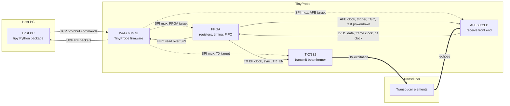

# TinyProbe System Overview

TinyProbe is a wireless ultrasound research platform split across host software,
MCU firmware, FPGA gateware, and analog front-end hardware. Start here when you
need the whole system model before working on one subsystem.

## Main Components

| Component | Main responsibility | Where to look |
| --- | --- | --- |
| Host PC | Builds acquisition configs, writes AFE/TX/FPGA settings, receives RF data, and runs processing tools. | [Software](../software/index.md) |
| MCU firmware | Owns Wi-Fi command and bulk links, SPI target selection, power control, FPGA FIFO readout, and command handlers. | [Firmware](../firmware/index.md) |
| FPGA gateware | Generates shot timing, captures LVDS data, controls AFE/TX timing pins, and buffers RF samples. | _Future Open-Sourcing_ |
| AFE5832LP | Receives analog echo signals, applies gain/TGC, digitizes data, and emits LVDS streams. | [Hardware & Control](hardware-control.md) |
| TX7332 | Generates transmit pulses and beamforming delays for the probe elements. | [Hardware & Control](hardware-control.md) |

## Control And Data Flow

The host software is the top-level control point. A measurement protocol such as
`tipy.protocol.example` prepares FPGA timing, AFE receive settings,
TX pulse settings, power commands, and a trigger-shot request. These commands
are sent to the MCU over the TCP command interface.

The MCU receives framed protobuf commands, selects the required SPI destination,
and performs the low-speed configuration transactions. FPGA register writes use
the FPGA SPI slave. AFE and TX programming uses the same MCU SPI peripheral, but
the firmware changes the mux state so the transaction reaches the selected
external device.

During acquisition, the FPGA is responsible for precise timing. It emits trigger
and clock/control signals to the TX and AFE, receives LVDS sample data from the
AFE, writes samples into its RX FIFO, and exposes the FIFO through the SPI slave.
The MCU waits for the selected FPGA interrupt event, reads the FIFO over SPI, and
sends RF data packets back to the host over UDP.

## One Acquisition

A typical ultrasound acquisition follows this sequence:

1. The host creates a modality configuration: enabled LVDS lanes, sample count,
   shot period, AFE gain/TGC settings, TX pulse profile, and timing delays.
2. The host sends register and method commands to the MCU.
3. The MCU initializes or updates FPGA, AFE, and TX state by selecting the
   correct SPI target for each transaction.
4. The host powers on the required rails through MCU control methods. Common
   domains include positive high voltage, negative high voltage, negative 5 V,
   and the LVDS IO supply.
5. The host sends a trigger-shot command. For a software-triggered acquisition,
   the MCU writes the FPGA start command.
6. The FPGA waveform generator aligns the shot to its internal period, emits the
   TX/AFE trigger at the trigger point, enables the relevant clocks and
   powerdown signals, and opens the FIFO write window.
7. The AFE digitizes receive data and sends LVDS data, frame clock, and bit
   clock to the FPGA.
8. The FPGA writes the selected data window into the RX FIFO and raises the
   configured MCU interrupt source.
9. The MCU enables readout, reads FIFO data over SPI, packetizes it, and sends
   UDP bulk packets to the host.
10. The host reassembles and parses the RF data for saving, plotting, or further
    ultrasound processing.

For deeper subsystem detail, continue with [Hardware & Control](hardware-control.md) and [Acquisition Timing](acquisition-timing.md).

## Where To Start

| Track | Start here | Then inspect |
| --- | --- | --- |
| System behavior | [System Overview](index.md) | [Acquisition Timing](acquisition-timing.md) |
| Host software | [Software Overview](../software/index.md) | `software/` |
| Firmware | [Firmware Overview](../firmware/index.md) | `firmware/`, especially methods and HAL drivers |
| Gateware | _Future Open-Sourcing_ | _Future Open-Sourcing_ |
| Hardware control | [Hardware & Control](hardware-control.md) | Firmware mux/power drivers and FPGA SPI demux logic |

## Traceability Hints

Most TinyProbe features cross subsystem boundaries. When adding a feature, trace
the setting through the stack:

1. Host config field or HAL property.
2. Protobuf command or register write.
3. MCU method handler and SPI mux target.
4. FPGA register, external AFE/TX register, or MCU power GPIO.
5. Timing signal, data path, or returned UDP packet format.

This trace keeps feature work local while making the system-level side effects
explicit.
