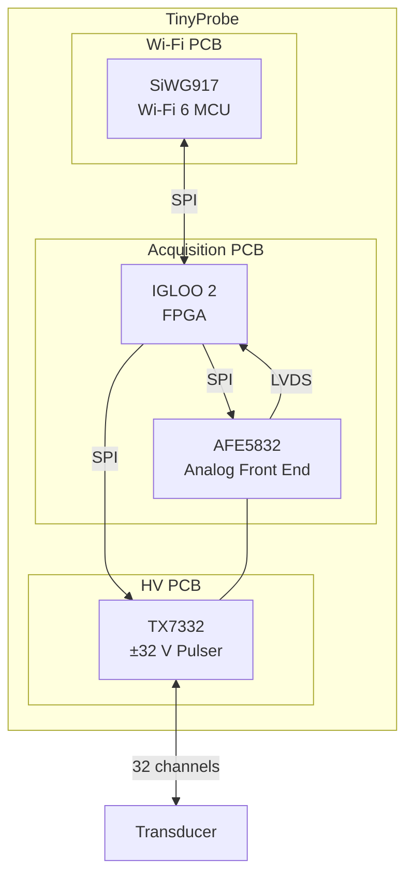

# TinyProbe Hardware

This directory contains the PCB projects of the TinyProbe project. It includes the schematics, layouts and production files.

## Contents

```bash
hardware/
├── acquisition_board/      # Acquisition board (FPGA & AFE)
│   ├── acquisition_board/  # Main acquisition board project
│   └── power_fix_board/    # Power fix board project
├── hv_board/               # Pulser board project (Helios-T)
└── wifi_board/             # Wi-Fi 6 board project
```

The boards are connected as shown in the diagram below.



## Errata

### Power Fix Board

Due to a minor mistake in the power architecture of the original acquisition board, a separate power fix board (`acquisition_board/power_fix_board`) was designed to correct the issue. This board needs to be soldered onto the main acquisition board to ensure proper power distribution.

## Sources

Sources referenced can be found in the [sources.md](sources.md) file.

## License

The hardware designs in this directory are licensed under the [Solderpad Hardware License Version 0.51](../licenses/LICENSE.hw)
