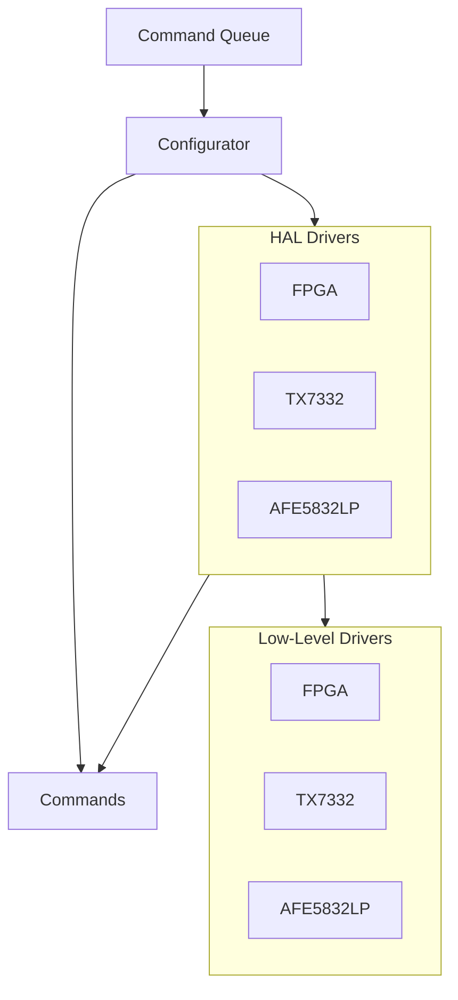

# TinyProbe Python API

## System Overview

```mermaid
graph TD
    direction TB

    subgraph Z[Low-Level Drivers]
        A[FPGA]
        B[TX7332]
        C[AFE5832LP]
    end

    subgraph Y[HAL Drivers]
        FPGA
        TX7332
        AFE5832LP
    end

    Y --> Z
    Y --> X[Commands]

    W[Configurator] --> Y
    W --> X

    V[Command Queue] --> W
```
